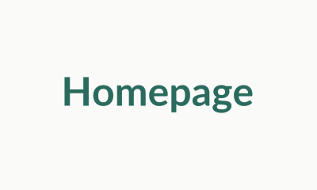
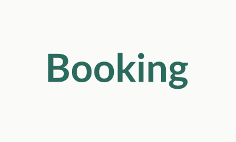
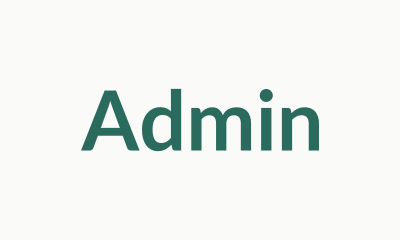

# Novita Health — Full-Stack Clinic Website

Modern marketing site and protected admin dashboard for **Novita Health**, a private clinic in Kigali (general medicine, mental health, nutrition, physiotherapy). **React + Vite** frontend, **Node.js + Express + MongoDB** backend, JWT admin auth, booking and contact APIs, and optional email notifications via Nodemailer.

## Live demo

This submission is set up to **run locally** (see [Getting started](#getting-started)). There is no bundled public deployment URL. If you later host the client and API (for example Vercel or Netlify for the frontend and Railway or Render for the backend, with MongoDB Atlas), replace this paragraph with your production link.

## Screenshots

Captured from a local run after seeding the database:

| Homepage | Booking form | Admin dashboard |
|----------|--------------|-----------------|
|  |  |  |

## Tech stack


## Getting started

### Prerequisites

- Node.js (LTS recommended)
- MongoDB running locally or a connection string (e.g. MongoDB Atlas)

### Install dependencies

```bash
cd client && npm install
cd ../server && npm install
```

### Environment

Copy `server/.env.example` to `server/.env` and set at least:

- `MONGODB_URI`
- `JWT_SECRET` (use a long random string in production)

Optional: `EMAIL_*` and `ADMIN_EMAIL` if you want booking notifications via Nodemailer. The API still saves appointments if email is not configured.

### Seed the database

From the `server` folder:

```bash
cd server
npm run seed
```

This creates the admin user, four doctors, and four services.

### Run both servers

**Terminal 1 — API (port 5000 by default):**

```bash
cd server && npm run dev
```

**Terminal 2 — client (Vite, port 5173):**

```bash
cd client && npm run dev
```

Open [http://localhost:5173](http://localhost:5173). In development, requests to `/api` are proxied to the Express server.

### Admin login

- URL: [http://localhost:5173/admin](http://localhost:5173/admin) (redirects to `/admin/login` if not signed in)
- **Email:** `admin@novitahealth.com`
- **Password:** `Admin@2024`

Change the admin password in production (re-seed or update the user in MongoDB).

## Project layout

- `client/` — React + Vite SPA, public site and `/admin/*` dashboard
- `server/` — Express REST API, Mongoose models, JWT middleware, Nodemailer helpers
- `docs/screenshots/` — screenshots referenced above

## Scripts

| Location | Command | Purpose |
|----------|---------|---------|
| `server/` | `npm run dev` | API with Node `--watch` |
| `server/` | `npm start` | API without watch |
| `server/` | `npm run seed` | Seed admin, doctors, services |
| `client/` | `npm run dev` | Vite dev server |
| `client/` | `npm run build` | Production build to `client/dist` |
| `client/` | `npm run lint` | ESLint |

## Author & acknowledgments

**Author:** Serge Ishimwe

**AI tooling:** This project was built by the author with assistance from [Cursor](https://cursor.com), an AI-assisted coding environment used for suggestions, refactors, debugging, and documentation. The author reviewed, tested, and is responsible for all submitted work.

## License

This project is licensed under the [MIT License](LICENSE).
